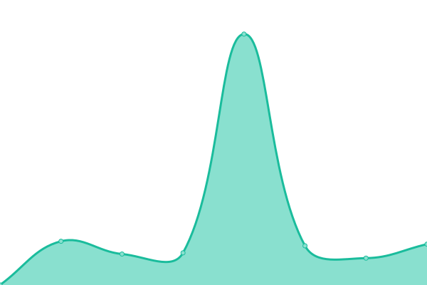

# [📈 Live Status](https://demo.upptime.js.org): <!--live status--> **🟩 All systems operational**

This repository contains the open-source uptime monitor and status page for [Upptime](https://upptime.js.org), powered by [Upptime](https://github.com/upptime/upptime).

With [Upptime](https://upptime.js.org), you can get your own unlimited and free uptime monitor and status page, powered entirely by a GitHub repository. We use [Issues](https://github.com/upptime/upptime/issues) as incident reports, [Actions](https://github.com/mackibert/up/actions) as uptime monitors, and [Pages](https://demo.upptime.js.org) for the status page.

<!--start: status pages-->
<!-- This summary is generated by Upptime (https://github.com/upptime/upptime) -->
<!-- Do not edit this manually, your changes will be overwritten -->
<!-- prettier-ignore -->
| URL | Status | History | Response Time | Uptime |
| --- | ------ | ------- | ------------- | ------ |
|  [adapter](http://adapter.herzstiftung.de) | 🟩 Up | [adapter.yml](https://github.com/mackibert/up/commits/HEAD/history/adapter.yml) | 

 762ms
     
 | 

<a href="https://mackibert.github.io/up/history/adapter">100.00%</a>
    

|  [dhs](https://www.herzstiftung.de) | 🟩 Up | [dhs.yml](https://github.com/mackibert/up/commits/HEAD/history/dhs.yml) | 

 897ms
     
 | 

<a href="https://mackibert.github.io/up/history/dhs">100.00%</a>
    

|  [ba](https://beauftragte-herzstiftung.de) | 🟩 Up | [ba.yml](https://github.com/mackibert/up/commits/HEAD/history/ba.yml) | 

 708ms
     
 | 

<a href="https://mackibert.github.io/up/history/ba">100.00%</a>
    

|  [Adapter Shop Items live](adapter.herzstiftung.de:8081/item) | 🟩 Up | [adapter-shop-items-live.yml](https://github.com/mackibert/up/commits/HEAD/history/adapter-shop-items-live.yml) | 

 526ms
     
 | 

<a href="https://mackibert.github.io/up/history/adapter-shop-items-live">100.00%</a>
    

|  [Keycloak](93.90.204.222) | 🟩 Up | [keycloak.yml](https://github.com/mackibert/up/commits/HEAD/history/keycloak.yml) | 

 134ms
     
 | 

<a href="https://mackibert.github.io/up/history/keycloak">92.25%</a>
    

|  [Mosquitto](93.90.204.222) | 🟩 Up | [mosquitto.yml](https://github.com/mackibert/up/commits/HEAD/history/mosquitto.yml) | 

 135ms
     
 | 

<a href="https://mackibert.github.io/up/history/mosquitto">100.00%</a>
    

|  [Adapter 8081](adapter.herzstiftung.de) | 🟩 Up | [adapter-8081.yml](https://github.com/mackibert/up/commits/HEAD/history/adapter-8081.yml) | 

 129ms
     
 | 

<a href="https://mackibert.github.io/up/history/adapter-8081">100.00%</a>
    

|  [Adapter 8082](adapter.herzstiftung.de) | 🟩 Up | [adapter-8082.yml](https://github.com/mackibert/up/commits/HEAD/history/adapter-8082.yml) | 

 129ms
     
 | 

<a href="https://mackibert.github.io/up/history/adapter-8082">100.00%</a>
    

|  [Adapter 8083](adapter.herzstiftung.de) | 🟩 Up | [adapter-8083.yml](https://github.com/mackibert/up/commits/HEAD/history/adapter-8083.yml) | 

 128ms
     
 | 

<a href="https://mackibert.github.io/up/history/adapter-8083">100.00%</a>
    

<!--end: status pages-->

[**Visit our status website →**](https://demo.upptime.js.org)

## 📄 License

- Powered by: [Upptime](https://github.com/upptime/upptime)
- Code: [MIT](./LICENSE) © [Anand Chowdhary](https://anandchowdhary.com), supported by [Pabio](https://pabio.com)
- Data in the `./history` directory: [Open Database License](https://opendatacommons.org/licenses/odbl/1-0/)
